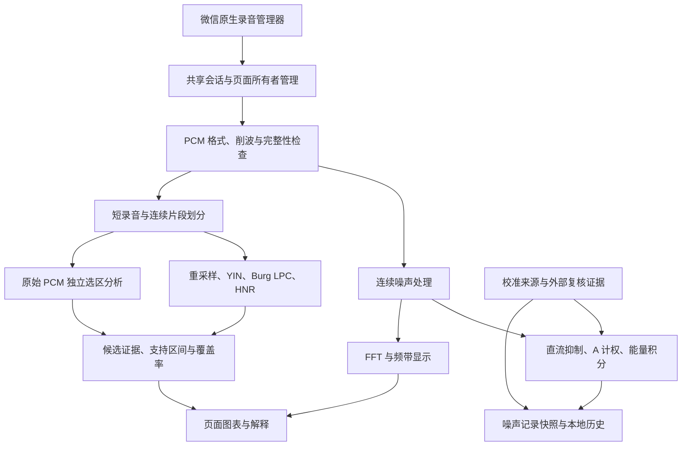

# 微信小程序噪声测量与探索性语音分析的声学算法及工程实现

**Acoustic Algorithms and Engineering Implementation of a WeChat Mini Program for Noise Measurement and Exploratory Speech Analysis**

作者、单位及通信作者：待填写。

稿件类型：方法与软件工程论文。实现描述对应 2026 年 10 月 4 日的工作区源码，算法标记为 `acoustics-2026-10-04.1`，结果结构版本为 2。工作区包含尚未提交的变更，不能以仓库已有提交号代替本文实现快照。本文汇总既有验证报告，没有为写作新增声学实验或执行程序测试；2026 年 10 月 2 日的科学性结果与 10 月 4 日的工程回归分别报告。

## 摘要

**目的：** 介绍一种运行于微信小程序的噪声测量与探索性语音分析系统，说明数字信号处理、参考校准、录音生命周期管理及结果可追溯设计。**方法：** 系统请求 44.1 kHz 单通道 PCM 输入。噪声分支采用连续直流抑制、数字 A 计权和样本能量积分，计算等效电平及基于预计暴露时长的八小时归一化估计，并提供 FFT 频谱与近似三分之一倍频程显示。语音分支采用抗混叠重采样、基于 YIN 的基频估计、Burg 线性预测及复极点分析，结合邻阶模型匹配、时间跟踪和可选参数敏感性复核，生成共振峰候选；另计算限带自相关谐噪比、数字声强和帧周期变异。工程实现使用共享录音会话、分段失败隔离、输入支持区间、独立原始 PCM 选区重分析及版本化元数据。**结果：** 既有 10 月 4 日报告中的五组工程回归共 138 项通过。此前已知极点合成集显示，共振峰覆盖率未达到预设的 80% 门槛，并出现超过 10% 频率误差的已接受值；新增对照输入的 F1 最大相对误差为 12.36%。**结论：** 当前实现提供了可解释、可追溯的便携式分析流程，但工程回归不能替代真机、计量或临床验证。单点校准不证明宽带准确性，共振峰仍应作为实验性分析结果使用。

**关键词：** 微信小程序；噪声测量；数字 A 计权；基频估计；Burg 线性预测；录音会话；可追溯性

## Abstract

**Objective:** To describe the acoustic methods and engineering implementation of a WeChat mini program for noise measurement and exploratory speech analysis. **Methods:** The application requests mono PCM at 44.1 kHz. Its noise pipeline combines continuous DC suppression, digital A weighting and sample-based energy integration, with FFT spectra and approximate third-octave displays. Its speech pipeline includes anti-alias resampling, a YIN-based fundamental-frequency estimator, Burg linear prediction and complex-pole analysis. Formant candidates are assessed through neighbouring-order matching, temporal tracking and optional parameter-sensitivity checks. Additional outputs include band-limited autocorrelation HNR, digital intensity and frame-period variability. Shared recorder sessions, input-support intervals, independent raw-PCM selection analysis and versioned metadata address asynchronous acquisition and interpretation. **Results:** Existing engineering reports dated October 4, 2026 recorded 138 passing checks across five suites. Earlier known-pole synthetic evaluations failed the predefined 80% formant-coverage criterion and retained some estimates with frequency errors above 10%; the maximum accepted F1 error in the additional comparison set was 12.36%. **Conclusion:** The implementation supports traceable exploratory analysis. It has not established device-wide metrological or clinical validity. Single-point calibration does not demonstrate broadband accuracy, and formants remain experimental outputs.

## 1 引言

移动终端为声学教学、环境观察和语音探索提供了低成本入口，但同一算法在不同麦克风、录音路由、系统增益和平台处理条件下可能产生不同结果。Kardous 与 Shaw 对手机声级应用的研究，以及后续外接校准麦克风研究，说明评估对象应包含实际软硬件采集链，不能只考察应用中的分贝公式。[1](https://stacks.cdc.gov/view/cdc/36704)、[2](https://pmc.ncbi.nlm.nih.gov/articles/PMC5102154/) NoiseCapture 将移动测量与校准、测量条件和环境记录结合，为便携式噪声工具提供了可参考的工程实践。[3](https://noise-planet.org/noisecapture.html)、[4](https://onomap-gs.noise-planet.org/noisecapture_calibration.html)

语音分析也存在相同的解释问题。基频、谱包络和周期性指标并非同一物理量；共振峰估计还受到分析带宽、模型阶数、窗函数及基频的影响。Praat 的 Burg 共振峰方法明确要求根据说话人和信号选择搜索上限，并指出错误设置可能改变低频共振峰的数量。[5](https://praat.org/manual/Sound__To_Formant__burg____.html) 因此，移动系统既需要实现信号处理，也需要记录每项输出的输入范围和算法条件。

本文描述的小程序包含实时噪声监测、简易麦克风校准、高级参考校准及语音学分析模块。研究重点是：将噪声与语音处理组织为明确的数字计算流程；在异步录音条件下管理输入完整性与资源交接；在保留无校准使用和历史记录的同时，区分数值、来源及验证程度。本文不提出新的 YIN 或 Burg 理论，也不声称移植或完整复现 Praat、NoiseCapture。相关项目用于方法核查和工程比较。

## 2 系统架构与数据定义

### 2.1 分层架构

系统以微信录音管理器为输入，由共享会话模块协调页面的启动、停止及中断。噪声分支逐块处理 PCM，语音分支在短录音结束后合并样本并执行分步分析。页面负责参数选择、结果解释和 Canvas 绘图；校准与结果模块提供来源描述、记录保存和历史兼容。图 1 概括其数据流。

图 1 为逻辑架构，不能据此推断语音结果已经持久化到噪声历史。当前噪声记录通过本地存储保存；语音页面的原始 PCM 与分析对象用于当前录音及选区操作，主要保留在运行内存中。

### 2.2 采集配置与数字电平

各测量模块请求 44.1 kHz、单通道、`PCM` 格式和 `frameSize=16` 的录音配置，按 `Int16Array` 解读收到的帧。这里的配置是应用请求，尚未通过真机验证证明所有设备均按相同采集链输出。令有符号整数样本为 $q[n]$，归一化样本为

$$
x[n]=\frac{q[n]}{32768}.
\tag{1}
$$

本实现的数字 RMS 电平定义为

$$
L_{\mathrm{dig}}=20\log_{10}\left(\max\left[\sqrt{\frac{1}{N}\sum_{n=0}^{N-1}x^2[n]},10^{-12}\right]\right).
\tag{2}
$$

其参考幅度为 1。按此定义，理想满幅正弦的 RMS 电平约为 −3.01 dB。本文称该量为 dBFS，并明确其 RMS 归一化约定。声压级则以物理声压及其参考量定义，不能由整数幅度直接获得。噪声模块使用偏移量 $O$ 建立近似映射 $\hat L=L_{\mathrm{dig}}+O$；没有适用校准时，该数值只有基于预设增益的估计意义。语音声强不加噪声校准偏移，始终保留数字域含义。

### 2.3 主要参数

表 1 列出当前实现的主要参数。名义参数与实际派生参数一并记录，避免页面选择值被误认为内部算法的完整设置。

| 处理环节 | 当前参数或约定 |
| --- | --- |
| 原生录音请求 | 44 100 Hz，单通道 PCM；Android 优先请求 `voice_recognition`，其他平台优先 `auto` |
| 噪声直流抑制 | 2 Hz 一阶连续滤波；跨回调保留状态 |
| 噪声 A 计权 | 两个二阶节与 129 抽头 FIR 串联；1 kHz 增益归一化 |
| 噪声频谱 | Hann 窗，32 768 点 FFT，8 192 样本帧移 |
| 频带显示 | 29 个名义中心频率，25 Hz 至 16 kHz；按二进制三分之一倍频程边界分组 |
| 简易/参考校准 | 分别累计 2 s/5 s 样本；参考校准仅检查稳定 1 kHz 纯音 |
| 语音录音 | 目标 5 s；接受结束边界至 5.25 s，保留实际样本时长 |
| 基频分析 | 12 kHz；1 024 样本窗，120 样本帧移；搜索 40–1 200 Hz |
| 共振峰默认值 | 5 000 Hz 上限、25 ms Hamming 窗、10 ms 帧移；12 kHz 基准阶数 12 |
| 共振峰可选参数 | 基准阶数 8/10/12/14，上限 4–8 kHz 的离散选项，窗长 25/40 ms |
| 共振峰分析采样率 | $f_{\mathrm{LPC}}=2(f_c+1000)$，$f_c$ 为搜索上限 |
| 重采样 | 257 点 Blackman 加窗 sinc 插值核，归一化直流增益 |
| 共振峰质量判据 | 90 Hz 至搜索上限；带宽不超过 500 Hz；邻阶与跟踪一致性；$f\geq1.5F_0$ 接受门槛 |
| 谐噪比 | 5.5 kHz 低通、12 kHz 分析率、约 85.33 ms 自相关窗；约 60 dB 数值上限 |
| 数字声强 | 未预加重信号，25 ms 矩形窗，10 ms 帧移，dBFS |
| 宽带语谱图 | 原输入采样率，约 5 ms Hann 窗，2 ms 帧移，零填充至 1 024 点 |
| 长期平均谱 | 原输入采样率，2 048 点 Hann 窗，50% 重叠；功率谱密度 dBFS/Hz |

表中的质量阈值为工程判据，尚无本系统受试者数据支持其作为生理学界限或临床正常值。

## 3 噪声测量算法

### 3.1 连续直流抑制与输入质量

噪声及校准输入首先通过连续直流抑制器。令 $a=\exp(-2\pi\cdot2/f_s)$，其递推式为

$$
y[n]=\frac{1+a}{2}\bigl(x[n]-x[n-1]\bigr)+a\,y[n-1].
\tag{3}
$$

滤波器状态跨 PCM 回调保留。因此，相同样本以不同长度分块交付，不会仅因分块边界重置滤波器而产生额外跃变。该处理也意味着所谓未加 A 计权分支已经过低频直流抑制，不能无条件称为通过仪器规范验证的 Z 计权通路。

质量检查采用跨回调的 10 ms 滑动窗，统计正负整数轨道样本，并记录削波区间和连续轨道长度。亚满幅长平台只产生疑似限幅提示，不能据此识别所有模拟压缩、自动增益或降噪。噪声监测对削波、格式错误及持续数字静音标记无效；单个很短的零值尾块不直接证明设备故障。语音分析可排除受影响支持区间并保留其他片段。缺少适用校准与输入已经损坏是不同状态，前者不会使普通检测和保存功能不可用。

### 3.2 数字 A 计权

当前 A 计权并非纯频域曲线加值，也不是简单的单个 IIR。实现先将低频相关模拟极点映射到数字域，组成两个二阶节，再设计高频修正 FIR。参考幅度函数为

$$
R_A(f)=\frac{12194.217^2 f^4}
{(f^2+20.598997^2)\sqrt{(f^2+107.65265^2)(f^2+737.86223^2)}(f^2+12194.217^2)},
\quad
\bar R_A(f)=\frac{R_A(f)}{R_A(1000)}.
\tag{4}
$$

低频二阶节使用双线性极点映射 $p=(2f_s-2\pi f)/(2f_s+2\pi f)$。高频修正以目标幅度与前级幅度之比生成 2 048 点频域设计样本，经实偶逆变换和 Blackman 截断得到 129 抽头 FIR，再归一化总链路的 1 kHz 增益。二阶节和 FIR 均跨输入块保持状态。

采用有限长录音时，最后一个输入样本之后仍可能存在计权滤波尾部能量。实现只向 A 计权器输入零，按 256 样本块累积尾能量，直到连续八块小于记录能量比例阈值 $10^{-12}$，或达到约 2 s 上限。尾部不增加真实录音样本数，并记录收敛状态；不会向直流抑制器重新输入零以制造额外台阶。此处理是有限记录零延拓约定的数值近似。

以上仅说明数字设计。IEC 61672-1 对完整声级计系统规定性能要求及等级，不能依据实现了参考 A 曲线便宣称获得 1 级或 2 级仪器性能。[6](https://webstore.iec.ch/en/publication/5708)

### 3.3 样本能量积分与暴露时长换算

令 $z_A[n]$ 为 A 计权后的归一化输入，$E_A=\sum z_A^2[n]$，$N_r$ 为实际收到的样本数。有限记录的等效电平估计为

$$
\hat L_{Aeq}=10\log_{10}\left(\max\left[\frac{E_A+E_{\mathrm{tail}}}{N_r},10^{-24}\right]\right)+O.
\tag{5}
$$

公式在输入完整且校准适用时才可解释为整段物理等效声级估计；对完整性未知或部分交付，记录保留“已接收音频”范围。积分依赖样本总能量及总数，不对分贝值做算术平均，也不把录音回调次数当作时间。页面按样本数组织秒级显示，但这些显示间隔不等于声级计 Fast/Slow 指数时间计权。

程序内部字段 `CNE` 采用

$$
\hat L_{EX,8h}=\hat L_{Aeq}+10\log_{10}\left(\frac{T_e}{28800}\right),
\tag{6}
$$

其中 $T_e$ 为用户填写的预计暴露秒数，而非已经测得的全天暴露时长。该式要求短时采样对预计暴露具有代表性。例如，若采样电平为 80 dB，预计持续 2 h，则数值为约 73.98 dB；这一计算示例不构成实测结果。`CNE` 在本文中仅指此应用字段，不等同于跨年累计暴露量，也未加入峭度修正、间歇结构或个体听力模型。默认风险阈值 80/85/94/105 dB 及报警配置属于应用设置，不应写为已经验证的医学或法规分类。

### 3.4 FFT 与近似三分之一倍频程

噪声频谱使用直流抑制后的未加 A 计权信号，以 Hann 窗计算 $M=32768$ 点 FFT。名义窗时长约 743.04 ms，帧移约 185.76 ms，频率间隔约 1.346 Hz。令 $X[k]$ 为窗后 FFT，$U=\sum w^2[n]$，保存的单边频点均方贡献为

$$
P[k]=\frac{c_k|X[k]|^2}{M U},\qquad c_0=1,\ c_k=2\ (k>0).
\tag{7}
$$

当前数组保存 $k=0,\ldots,M/2-1$，不保存 Nyquist 单点。频点显示 $10\log_{10}P[k]+O$，它是频点能量贡献电平，不是每赫兹功率谱密度。

频带的名义中心频率用于标签，实际计算中心为 $1000\cdot2^{(i-16)/3}$ Hz，边界为中心频率乘以 $2^{\pm1/6}$。程序仅累加中心频率落在边界内的 FFT bins，在功率域求和后转换为分贝。该方法具有有限窗泄漏和边界整 bin 近似，不等同于标准三分之一倍频程滤波器组；也没有用相邻频带数据填补空带。频谱所加单个偏移量只能修正整体增益，不能自动修正手机的频率响应。

## 4 校准方法与实验室证据

### 4.1 简易估计和单点参考校准

简易麦克风校准累计完整 2 s PCM，利用用户选择的参考环境电平估计偏移量。它能够提供使用入口，但环境类别不能保证实际声压，因而只能称为估计校准。整段最小值、最大值、能量及连续质量状态用于判断信号，不能由最后一个短回调独立决定整段是否有效。

高级校准在原生启动确认后倒计时，再累计准确 5 s 的去直流样本。用户填写 40–120 dB 的参考仪器读数及可选仪器、输入链、不确定度说明。令参考读数为 $L_{\mathrm{ref}}$，则

$$
O=L_{\mathrm{ref}}-L_{\mathrm{dig,cal}}.
\tag{8}
$$

纯音质量检查采用 4 096 点 Hann 窗，逐块检查 950–1050 Hz 能量占正频率能量的比例是否至少为 90%、块电平是否不低于 −70 dBFS，以及块间范围是否不超过 1.5 dB，并检查削波和完整样本数。这里的阈值是输入质量筛选，不能证明参考仪器、耦合器密封、声场均匀性或溯源链正确。

NoiseCapture 官方校准说明也采用参考读数与测得等效电平之差获得整体增益，并明确区分该修正与多频校准。[4](https://onomap-gs.noise-planet.org/noisecapture_calibration.html) 本系统的单点偏移只支持所用频率、声级和采集条件；它不能证明宽带线性度，也不能保证 AGC 或降噪发生变化之后仍适用。

### 4.2 附加实验室测点及条件比较

高级校准页面允许导入外部频率—声级测点。系统保存参考声级、数字电平、所用偏移量、测量日期、输入链、计权、采集配置及积分时长。首先保存原始读数差

$$
\Delta_j=L_{\mathrm{dig},j}+O-L_{\mathrm{ref},j}.
\tag{9}
$$

只有用户声明的计权相同且明确、采集配置匹配、参考与被测积分时长相同、输入链已经说明时，才将其另标为可比较残差。未知或不一致条件仍保留原始差值，而不自动换算。按同一频率的不同声级计算数字电平对参考声级的回归斜率，可提示增益压缩，但不证明压缩原因，也不自动生成频响补偿。

导入模块仅描述所列离散测点，不插值、外推或计算完整测量不确定度预算。其 `captureChainVerified` 和 `quantitativeUseValidated` 均保持 false：字段齐全表示可以按声明条件比较，不表示系统已经独立验证实验室操作。单点复测可利用已声明扩展不确定度作保护带判断，同样不等于完整计量不确定度评定。

### 4.3 可用性与历史证据

无校准用户仍可检测和保存，记录附加校准来源及估计性质；完整性问题则单独记录为无效、部分或未核验。历史检测保留原数值和原参数，过时算法添加说明，不用新算法静默重算。旧实验室预设不因新增加的设备、采集配置或期限检查被额外拦截；保持可使用性并不表示其准确性由当前版本重新获得证明。

复核记录以历史数组追加，同时保留旧单报告字段兼容。页面显示原偏移量、报告日期和原条件，明确区别历史证据与当前参数。无法绑定校准或保存失败时显示未保存摘要，避免把临时显示误认为证据已经落盘。这一设计将测量入口与证据强度分开，使缺少实验室条件的用户仍能使用工具，并允许有条件的用户附加可追溯记录。

## 5 探索性语音分析算法

### 5.1 预处理与抗混叠重采样

语音输入按整段或连续片段减去平均值，并归一化为浮点信号。用于基频和 HNR 的分支重采样至 12 kHz，低通目标为 5.5 kHz。重采样使用 257 点 Blackman 加窗 sinc 核，并归一化核系数和；采样边缘采用最近样本延拓，但定量输出通过支持区间排除依赖不完整滤波输入的边缘。

共振峰分析采用独立带宽。令搜索上限为 $f_c$，重采样率为 $2(f_c+1000)$，滤波目标为 $f_c+500$ Hz，并受输出 Nyquist 限制。预加重为 $s[n]=x[n]-\alpha x[n-1]$。基准 $\alpha=0.97$ 对应 12 kHz 下约 58.17 Hz 的参数频率；共振峰分支按实际采样率换算 $\alpha$，使改变上限时该参数频率保持不变。实际 LPC 阶数为

$$
p_{\mathrm{eff}}=\max\left(4,\operatorname{round}\left[p_{\mathrm{UI}}\frac{f_{\mathrm{LPC}}}{12000}\right]\right).
\tag{10}
$$

因此，页面阶数表示 12 kHz 基准复杂度。该缩放是本实现的工程选择，不是 Praat 的模型阶数定义。宽带语谱图则在原输入采样率上使用固定系数 0.97 预加重，不能与共振峰分支的频率保持设置混写。

### 5.2 基于 YIN 差分思想的基频估计

YIN 的核心思想是在延迟域度量周期重复性，并通过累积均值归一化差分减少选错周期的机会。[7](https://pubmed.ncbi.nlm.nih.gov/12002874/) 本系统使用其差分思想的有限窗实现，而非宣称逐项复现原文所有步骤。

每帧包含 $N=1024$ 个 12 kHz 样本，帧移为 120 个样本。比较长度固定为 $W=\lfloor N/2\rfloor$，每个延迟 $\tau$ 的比较起点为 $j_0(\tau)=\lfloor(N-W-\tau)/2\rfloor$，计算

$$
d(\tau)=\sum_{j=j_0(\tau)}^{j_0(\tau)+W-1}\bigl(x[j]-x[j+\tau]\bigr)^2,
\qquad
d'(\tau)=\frac{\tau d(\tau)}{\sum_{u=1}^{\tau}d(u)}.
\tag{11}
$$

算法优先选择范围内第一个低于 0.1 的归一化局部谷；未找到时，仅接受最优谷不高于 0.3 的候选。之后在原始差分函数上做抛物线插值，获得亚样本延迟，并计算 $F_0=f_s/\hat\tau$。局部比较能量不足、范围边界及潜在高频越界倍周期候选均有单独拒绝原因。

窗长约 85.33 ms，实际输出间隔为 10 ms。它支持音高轮廓浏览，但会跨越短时发音变化，不能由帧移 10 ms 推断瞬时分辨率也是 10 ms；40–1200 Hz 搜索范围也不保证其中所有嗓音条件均已验证。

### 5.3 Burg LPC、复根与共振峰候选

每个有声帧使用 25 或 40 ms Hamming 窗。Burg 方法逐阶最小化前向和后向预测误差，其反射系数可写为

$$
k_m=-\frac{2\sum_n f_{m-1}[n]b_{m-1}[n]}{\sum_n\left(f_{m-1}^2[n]+b_{m-1}^2[n]\right)}.
\tag{12}
$$

实现采用独立更新缓冲区，避免前后向误差或系数在一次更新中相互覆盖。由 LPC 多项式 $A(z)=z^p+a_1z^{p-1}+\cdots+a_p$ 求根，使用同步 Durand–Kerner 复迭代及相对多项式残差检查。未满足数值条件的帧保留缺失，不以未收敛复根生成结果。Burg 模型和极点分析也用于 Praat 共振峰方法，但两者的重采样、窗函数和根筛选并不相同。[5](https://praat.org/manual/Sound__To_Formant__burg____.html)

对于单位圆内、上半平面的复根 $z_k=r_ke^{i\theta_k}$，极点频率与带宽为

$$
F_k=\frac{\theta_k f_{\mathrm{LPC}}}{2\pi},\qquad
B_k=-\frac{f_{\mathrm{LPC}}}{\pi}\ln r_k.
\tag{13}
$$

候选位于 90 Hz 至上限之间。基频有声门控与邻近时间约束先决定是否评估，再同时计算基准阶数及 $p\pm2$ 的极点。跨模型匹配采用允许缺失、频率单调、一对一的动态规划，匹配代价综合对数频率差与带宽差，分别使用约 10% 频率比例和 350 Hz 带宽差门槛。低频宽带或不一致根不能简单删除并把更高根自动改称 F1；仅在满足特定证据时排除阶数特有的额外根。

时间跟踪限制极点的单调对应和槽位变化；失去锚点后通过连续候选重新获取，而不是把任意最邻近极点接上轨迹。未满足模型一致性、带宽或编号条件时保留缺失。高基频下 $F_k<1.5F_0$ 的值降为待审候选，用于提示稀疏谐波风险。这一比值是保守的工程判据，既不是共振峰存在的生理界限，也不能消除所有共同模型偏差。

结果另保存邻阶极点证据和实际归一化预测残差

$$
\rho_{\mathrm{LPC}}=\frac{\sum_{n=p}^{N-1}\left(x[n]+\sum_{i=1}^{p}a_i x[n-i]\right)^2}{\sum_{n=p}^{N-1}x^2[n]}.
\tag{14}
$$

式（14）中的 $x[n]$ 指该 LPC 帧的加窗、预加重信号。数值残差较小只表示拟合该输入较好；多个模型可能共同拟合到谐波而非声道共振。因而模型一致性不是准确率、置信区间或物理真值。

### 5.4 参数敏感性复核

独立选区可启用额外复核：在相同 PCM 上选择两个邻近可用搜索上限及另一窗长重算。基准已接受值只有在各复核模型于相近时刻均被接受且频率比例差不超过门槛时，才继续保持接受状态。敏感值降为待审候选，缺失值不会因增加模型而自动升级。

这一机制用于暴露参数依赖，没有按最小残差、最接近典型元音或最多输出值自动选择结果。Praat FormantPath 同样提供多搜索上限分析的思想，但本系统没有实现或宣称等同其完整路径选择方法。[8](https://praat.org/manual/Sound__To_FormantPath__burg____.html)

### 5.5 限带自相关谐噪比

HNR 分支不把 YIN 归一化差分直接转换为谐噪比。它在 5.5 kHz 低通后的 12 kHz 信号上，以约 85.33 ms 帧计算独立自相关。去除帧均值后，使用零填充 FFT 得到线性自相关，并按延迟两侧的实际重叠能量归一化：

$$
r(\tau)=\frac{\sum_n x[n]x[n+\tau]}{\sqrt{\sum_n x^2[n]\sum_n x^2[n+\tau]}}.
\tag{15}
$$

候选峰在有效 YIN 周期附近约 ±15% 范围搜索。相关峰不足 0.2 等情况保留缺失；有效峰计算

$$
\widehat{HNR}=10\log_{10}\frac{r}{1-r}.
\tag{16}
$$

其中 $r$ 限制到不超过 $1-10^{-6}$，对应约 60 dB 的数值上限，并记录触顶帧。均值仅在可评估有声帧的有效比例至少为 50%、按帧移计算的有效时长至少为 0.10 s 时显示；该有声帧分母不同于全录音覆盖率。此方法依赖周期信号与噪声的模型假设。低通带宽、窗口和归一化与 Praat 的 HNR 实现存在差异，不能直接套用其参考值或称为同一测量。[9](https://praat.org/manual/Sound__To_Harmonicity__ac____.html)

### 5.6 数字声强与帧周期变异

声强轨迹在未预加重、已去均值的归一化信号上，以 25 ms 矩形窗按式（2）计算。单位为 dBFS，不是已校准的语音声压级。

帧周期变异由相邻有效音高帧的 $T_i=1/F_{0,i}$ 计算：

$$
V_T=\frac{\sum_{(i-1,i)\in\mathcal A}|T_i-T_{i-1}|}{\sum_{(i-1,i)\in\mathcal A}(T_i+T_{i-1})/2},
\tag{17}
$$

其中 $\mathcal A$ 仅包含连续有效有声帧，无声处重置，跨片段或削波情况下全段值不显示。内部兼容字段仍可名为 `jitter`，但方法上应称“帧周期变异”。它比较的是约 10 ms 间隔、85 ms 窗估计的周期，而不是逐个声门周期边界，不能称为临床 local jitter。连续言语中的韵律变化也会进入该量；系统未实现可据本文声称验证的逐周期 Jitter、Shimmer 或 CPP 诊断流程。

### 5.7 语谱图与长期平均谱

宽带语谱图以约 5 ms Hann 窗、2 ms 帧移计算 STFT，零填充至 1 024 点，经幅度标度、−80 至 0 的裁剪及颜色归一化显示。44.1 kHz 下物理窗约 221 样本；零填充增加频率显示点数，不增加物理频率分辨率。预加重和颜色裁剪后的显示不能直接用作定量功率谱密度。

LTAS 独立从未预加重的去均值信号计算，使用 2 048 点 Hann 窗和 50% 重叠，排除跨不连续边界及无效区间的窗。令有效窗数为 $J$，其单边平均功率谱密度为

$$
\hat S[k]=\frac{c_k}{Jf_s\sum w^2[n]}\sum_{j=1}^{J}|X_j[k]|^2,
\qquad L_{\mathrm{PSD}}[k]=10\log_{10}\hat S[k].
\tag{18}
$$

单位为 dBFS/Hz。先平均功率再取对数，与对语谱图颜色值或分贝值求均值不同。LTAS 使用的有效窗口集合仍需作为解释条件，不能默认代表被排除区间或未收到的音频。

## 6 工程实现与人机交互

### 6.1 共享录音会话与 Android 兼容

小程序的多个页面共享原生录音对象。会话层为每个原生对象集中安装事件分发，利用所有者、当前活动所有者和待启动请求区分页面生命周期。启动、录音、停止、等待系统恢复和错误阶段串行转移；新请求在旧原生停止确认之后启动。系统中断时，待启动请求需要同时满足恢复通知和停止确认，取消后的请求不会自动复活。停止超时产生明确失败，不把固定延迟当作硬件已经释放的证明。

帧分发检查当前所有者，页面隐藏或重新录音时清理定时器和资源，避免旧页面继续处理新录音。该设计处理可观察的事件阶段，但原生回调没有可逐条验证归属的录音会话标识；新录音实际启动后若出现不可区分的迟到旧事件，JavaScript 计数不能彻底证明其来源。因此模拟交错事件通过不等于所有 OEM 事件时序已被覆盖。

Android 优先请求 `voice_recognition`。官方原生 Android 文档说明多数录音源可能加工信号，且在不支持未处理源时可尝试 `VOICE_RECOGNITION`。[10](https://developer.android.com/media/platform/mediarecorder) 微信字符串到实际原生/OEM 链路的映射仍未实测，本系统不能据字符串保证关闭 AGC、降噪或使用了指定物理麦克风。明确不支持录音源、且尚未启动时，最多回退一次到兼容源；权限、采样配置和未知错误分别处理。兼容信息按品牌、型号、系统、微信与 SDK 环境区分，并保存请求、尝试、回退及未经核验的采集链说明。

### 6.2 样本时间、分段失败与覆盖率

时间坐标以实际收到的样本数除以采样率获得。停止时比较原生时长与样本数，以约 1 ms 对应样本加一个样本作为容差；一致仅表示两者相容，不证明不存在等量丢失和重复。缺少原生时长时标记未核验。

当两者不一致而缺失位置未知，语音页面将接收块连接处作为保守边界，分别分析片段；不会根据 JavaScript 墙钟补造缺失样本或原始时间。分段 DSP 避免跨未知缺口滤波，局部失败只排除相关片段，取消错误仍向外传播。收到的 PCM 可用于浏览，失败区间不进入定量摘要。保守分段可能增加边界排除，必须连同覆盖率报告。

覆盖率分母采用“理想连续的已接收 PCM 中可放置的完整分析窗数”，并另列实际计算窗、片段边界排除、失败片段、无效输入、接受值及待审候选。失败不会因输出数组变短而从分母消失。该口径用于发现算法输出损失，不是墙钟录音覆盖率，也不是有声识别准确率。对于缺少分析元数据的历史结果，总帧数显示未记录，不能用剩余轨迹点数代替理论分母。

### 6.3 输入支持区间与独立选区

每个输出保存时间中心及真实输入支持区间。基频和 HNR 支持包括约 85.33 ms 窗和重采样核边缘；共振峰还依赖有声门控的基频窗，支持可能大于 LPC 的 25 ms。滤波输入支持与跟踪决策上下文分开表示：某帧的极点来自局部窗，而是否接续当前 F1 槽位可能依赖此前轨迹。

普通选区只纳入支持区间完全落在选区内的帧。需要消除选区外去均值、滤波和跟踪影响时，系统按采样点取整从原始 Int16 PCM 截取选区，重置 DSP 与跟踪后独立分析，再映射回原时间轴。改变选区、页面或录音时增加分析代次并取消过期工作，迟到结果不能覆盖当前显示。

独立结果用于选区统计、元音图和轨迹叠加；选区外仍显示全段来源，交界处不跨来源连线。短选区可浏览，即使不足以产生完整基频或共振峰窗，也不能把未输出结果当作零值。原始支持区间排除与独立重分析解决不同问题，前者本身不保证脱离跟踪上下文。

### 6.4 计算调度与存储快照

当前语音页面在录音完成后通过主线程异步流水线分析。多个算法的同步与异步入口共用生成器实现，约每 8 ms 在允许的迭代点让出事件循环，并在阶段与迭代中检查取消条件。源码另提供 Worker 构建入口及一致性检查，但当前页面没有据此启用实际 Worker 分析，不能将其描述为生产环境并行加速。

生成器调度不是硬实时预算：单帧求根、部分图形计算和未切分循环仍可能耗时。Float32/Float64 类型数组及复用缓冲区减少重复分配，但目前没有跨设备延迟、内存峰值、热量或长时间运行的实测统计。44.1 kHz、5 s、16 位单通道原始 PCM 本身约为 441 000 字节，不能把该大小误认为整个分析的内存占用。

噪声停止后生成包含样本数、能量、未舍入结果、校准来源、输入完整性、设备及算法版本的快照，再进入本地历史；相同记录标识不重复添加。该设计可减少显示舍入和保存时重新计算之间的差异，但本地存储不是云端备份、事务数据库或密码学签名系统。源码哈希用于区分实现版本，不自动证明原始用户数据没有被改动。

### 6.5 结果呈现

图表在无效值、片段改变、分析来源改变或异常时间间隔处断线。非有限声强不参与纵轴范围计算，共振峰待审候选以空心点显示，并排除实线连接。页面同时说明参数、有效帧、候选帧和采集链状态，避免连贯曲线制造连续测量的错觉。

校准与过时算法标记作为结果解释信息，保存时保留来源，不要求每名用户具备实验室设备。新增说明沿用页面既有 WXSS 组件，并对较长实验室字段允许换行；这些是当前实现选择，尚无真机视觉验收或可用性受试者研究支持“交互已经优化”的实证结论。

## 7 既有验证方法与结果

### 7.1 工程回归

本文读取已有报告，不新增运行。2026 年 10 月 4 日的回归使用 Node、模拟录音事件和模拟 Canvas，结果见表 2。报告覆盖录音交接和系统中断、滑动削波、校准分块、覆盖率、独立选区、实验室声明条件及历史存储等路径。[实现与检查记录](rc-repairs-2026-10-04.md)

| 回归脚本 | 通过/总数 |
| --- | --- |
| `tests/rc-repairs.cjs` | 27/27 |
| `tests/recorder-usability.cjs` | 26/26 |
| `tests/scientific-followup.cjs` | 22/22 |
| `tests/scientific-repairs.cjs` | 17/17 |
| `tests/revision-regression.cjs` | 46/46 |
| 合计 | 138/138 |

已有包完整性记录另检查了 54 个语法文件、14 条路由、51 个绑定和 2 个 Worker 入口，并核查由 19 个模块生成的 Worker 内容。上述数量是工程检查项，不是独立受试者或声学重复测量数；名称包含“scientific”的脚本也不能仅凭名称当作临床验证。包检查不是微信开发者工具编译，模拟 Canvas 不是页面视觉验收。

### 7.2 合成信号与共振峰门槛

科学性结果取自 2026 年 10 月 2 日 `acoustics-2026-10-02.2` 的报告，并非 10 月 4 日版本的新测量。此前综合算法评估为 82/83 通过，F0=400 Hz 的三极点元音条件仍失败。10 月 4 日未重构 F0/LPC 极点识别，也未重跑该准确性集，故本文保留这些失败作为未解决证据，不宣称当前科学性门槛已经通过。[科学性核查记录](scientific-followup-2026-10-02.md)

已知极点合成集以生成模型的频率为真值。既定条件为每个共振峰相对频率误差不超过 10%、真值帧覆盖率至少 80%，且没有超过门槛的已接受值；缺失单列而不计为正确。表 3 直接汇总对应 JSON。覆盖率是接受帧/真值帧，超差计数只计已接受结果。不同集不能合并为一个准确率。

| 数据集及共振峰 | 接受帧/真值帧 | 覆盖率 | 超过 10% 误差的已接受帧 | 已接受值最大相对误差 |
| --- | --- | --- | --- | --- |
| 冻结合成集 F1 | 364/750 | 48.53% | 60 | 17.50% |
| 冻结合成集 F2 | 377/750 | 50.27% | 30 | 10.96% |
| 冻结合成集 F3 | 347/750 | 46.27% | 0 | 3.61% |
| 扩展回归集 F1 | 192/480 | 40.00% | 0 | 8.71% |
| 扩展回归集 F2 | 312/480 | 65.00% | 0 | 6.58% |
| 扩展回归集 F3 | 312/480 | 65.00% | 0 | 3.71% |
| 新增对照输入 F1 | 225/420 | 53.57% | 30 | 12.36% |
| 新增对照输入 F2 | 195/420 | 46.43% | 0 | 2.34% |
| 新增对照输入 F3 | 195/420 | 46.43% | 0 | 1.17% |

数据来源：[冻结集](formant-validation-results.json)、[扩展回归集](formant-holdout-results.json)、[新增输入与 Praat 对照](praat-comparison-results.json)。这些集均已用于检查，新增输入在首次运行前冻结，首次观察后也成为回归资料，不能继续称为未见留出集。

全部列出的覆盖率低于门槛。新增集 F1 的 30/225 个已接受值超差，说明拒绝大量不确定帧并没有消除全部错误接受。F2/F3 在该有限新增集未见超差，也不能外推为所有说话人或高 F0 情况准确。帧有重叠且共享合成条件，本文不把这些计数当作独立统计样本，不据此报告临床灵敏度、显著性或人群置信区间。

### 7.3 Praat 对照与窗口定义

独立 Python 对照使用 NumPy 2.5.3、Parselmouth 0.4.7 及其实际内嵌 Praat 6.1.38。两个实现接收完全相同的 Int16 PCM，并按生产帧中心取值，保存生成种子、输入及源码哈希。新增汇总包含 14 个输入条件，各共振峰 420 个真值帧；旧 F0=400 Hz 条件单列。Praat 是对照实现，不是合成集的真值来源。

Praat Burg 参数中的 `window_length=0.025` 指有效窗长，其实际高斯窗约为 50 ms，频率分辨率与 25 ms Hamming 窗近似可比。[5](https://praat.org/manual/Sound__To_Formant__burg____.html) 因此既有报告保留三种诊断：物理 25 ms 高斯窗；有效 25 ms、物理 50 ms 且采样率/阶数/预加重匹配；以及常用五共振峰、5 kHz 设置。匹配分辨率仍不等于匹配窗形、滤波、边缘和极点编号。

物理 25 ms 诊断是在不同有效分辨率下比较，不能据其误差宣称优于 Praat。即使采样率、阶数和近似分辨率匹配，候选拒绝机制仍不同，不能只看已接受值误差排名。本文报告自身方法未达门槛，而不利用特定对照设置的失败证明系统具有普遍优势。

## 8 讨论

### 8.1 计算正确性、计量准确性和临床有效性

当前实现的主要价值是明确数字量定义，保持跨分块处理一致，并让来源、缺失和边界进入结果解释。工程回归可以支持这些路径的可重复行为，却无法证明麦克风频响、录音路由和平台加工已经受到控制。具有实验室校准标签的旧参数仍可使用，但标签本身不能保证校准与当前链路相同。物理准确性应对麦克风、终端、系统和微信版本组成的实际系统进行验证。

语音方面，单频增益偏移不能纠正共振峰误识别；多阶模型一致也不能替代准确性验证。高基频意味着谱包络的采样更稀疏，多个全极点模型可能共同接受错误位置。已观察到的 F1 偏差可能改变元音图位置和选区比较，具有直接声学解释后果。当前程序因此更适合教学展示、算法探索及参数复核，不能依据本文认定其可用于临床诊断或以通用阈值判定病理程度。

### 8.2 尚未覆盖的验证

目前缺少 Android/iOS 真机上的二次启动、跨页交接、系统中断、权限恢复、源回退及保存回读验收；也缺少实际采集链的声级阶梯、频率响应、失真与噪声底实验。对于参考测量，还需要记录参考仪器、校准证书、声源、耦合或几何布置、计权、积分条件和不确定度预算。少量离散测点不能支持其间频率或其外声级的准确性声明。

语音算法仍需新的未见合成条件与真实语音语料，覆盖高 F0、相邻共振峰、过渡音、不同发声任务及录音处理条件。应同时报告每个参数的接受覆盖、错误接受和缺失，而不通过删除失败样本或降低既定门槛建立表面准确率。若研究临床用途，还需独立参考方法、受试者设计和伦理审批；本文没有此类研究结果。

### 8.3 可用性与证据要求的平衡

要求所有用户先取得实验室校准会显著降低工具可达性。当前设计允许用户录音、分析和保存，在结果层区分估计、参考过程完成、历史证据及采集链未核验。与此同时，削波或缺失不能因需要可用性而被包装成完整有效测量。可用性由可完成的操作流程支持，科学解释由相应证据支持，二者通过记录元数据连接。

## 9 结论

本文介绍了微信小程序中样本能量噪声估计、数字 A 计权、单点参考校准及 YIN/Burg 等探索性语音分析的当前实现，并说明录音会话、支持区间、选区重分析和历史证据管理如何影响结果解释。既有工程回归支持已覆盖路径的实现一致性；合成共振峰结果仍显示覆盖不足和错误接受。当前版本尚不能据此宣称获得宽带计量准确性或临床有效性。后续工作应优先完成真机采集链验证、独立声学对照及高基频共振峰方法验证，并保留原定判据和失败结果。

## 参考文献

[1] Kardous C A, Shaw P B. Evaluation of smartphone sound measurement applications. *The Journal of the Acoustical Society of America*, 2014, 135(4): EL186–EL192. DOI: 10.1121/1.4865269. [CDC 原文与元数据](https://stacks.cdc.gov/view/cdc/36704).

[2] Kardous C A, Shaw P B. Evaluation of smartphone sound measurement applications (apps) using external microphones—A follow-up study. *The Journal of the Acoustical Society of America*, 2016, 140(4): EL327–EL333. DOI: 10.1121/1.4964639. [期刊原文](https://stacks.cdc.gov/view/cdc/203482/cdc_203482_DS1.pdf)、[作者稿全文](https://pmc.ncbi.nlm.nih.gov/articles/PMC5102154/).

[3] Picaut J, Fortin N, Bocher E, Petit G, Aumond P, Guillaume G. An open-science crowdsourcing approach for producing community noise maps using smartphones. *Building and Environment*, 2019, 148: 20–33. DOI: 10.1016/j.buildenv.2018.10.049. [NoiseCapture 官方项目及引用信息](https://noise-planet.org/noisecapture.html).

[4] Noise-Planet. NoiseCapture calibration [EB/OL]. [官方校准方法说明](https://onomap-gs.noise-planet.org/noisecapture_calibration.html). 访问日期：2026-10-04.

[5] Praat. Sound: To Formant (burg)... [EB/OL]. [官方算法与窗口说明](https://praat.org/manual/Sound__To_Formant__burg____.html). 访问日期：2026-10-04.

[6] International Electrotechnical Commission. IEC 61672-1:2013: Electroacoustics—Sound level meters—Part 1: Specifications [S]. 2013. [IEC 官方标准目录](https://webstore.iec.ch/en/publication/5708). 本文核查了公开目录及范围说明，未据此宣称完成标准全部条款测试。

[7] de Cheveigné A, Kawahara H. YIN, a fundamental frequency estimator for speech and music. *The Journal of the Acoustical Society of America*, 2002, 111(4): 1917–1930. DOI: 10.1121/1.1458024. [PubMed 原始文献记录](https://pubmed.ncbi.nlm.nih.gov/12002874/).

[8] Praat. Sound: To FormantPath (burg)... [EB/OL]. [官方多上限分析说明](https://praat.org/manual/Sound__To_FormantPath__burg____.html). 访问日期：2026-10-04.

[9] Praat. Sound: To Harmonicity (ac)... [EB/OL]. [官方自相关 HNR 说明](https://praat.org/manual/Sound__To_Harmonicity__ac____.html). 访问日期：2026-10-04.

[10] Android Developers. MediaRecorder overview [EB/OL]. [官方录音源说明](https://developer.android.com/media/platform/mediarecorder). 访问日期：2026-10-04.

## 附录 A 实现与证据对应

为便于软件方法复核，表 A1 给出核心实现位置。相对链接按仓库结构解析；正式投稿时可转为软件补充材料中的文件清单。

| 内容 | 实现文件 |
| --- | --- |
| RMS、电平、A 计权及尾能量 | [audio-math.js](../utils/audio-math.js) |
| 直流与滑动削波检查 | [audio-quality.js](../utils/audio-quality.js) |
| 校准纯音质量检查 | [calibration-quality.js](../utils/calibration-quality.js) |
| 噪声 FFT 与频带 | [fft.js](../utils/fft.js)、[canvas-spectrum.js](../utils/canvas-spectrum.js) |
| 噪声接收、完整性及保存 | [main.js](../pages/main/main.js) |
| 录音会话与录音源 | [recorder-session.js](../utils/recorder-session.js) |
| 校准状态与外部实验室测点 | [data-model.js](../utils/data-model.js)、[laboratory-verification.js](../utils/laboratory-verification.js) |
| 高级单点校准 | [calibrate.js](../pages/advanced-calibrate/calibrate/calibrate.js) |
| 语音参数和流水线 | [phonetic-config.js](../utils/phonetic/phonetic-config.js)、[analysis.js](../utils/phonetic/analysis.js) |
| 重采样与基频 | [resample.js](../utils/phonetic/resample.js)、[yin-pitch.js](../utils/phonetic/yin-pitch.js) |
| Burg、复根与共振峰 | [burg-lpc.js](../utils/phonetic/burg-lpc.js)、[poly-roots.js](../utils/phonetic/poly-roots.js)、[formant-extract.js](../utils/phonetic/formant-extract.js) |
| 参数复核 | [model-sensitivity.js](../utils/phonetic/model-sensitivity.js) |
| HNR 与数字声强 | [harmonicity.js](../utils/phonetic/harmonicity.js)、[voice-metrics.js](../utils/phonetic/voice-metrics.js) |
| 支持区间、覆盖率及独立选区 | [time-support.js](../utils/phonetic/time-support.js)、[coverage.js](../utils/phonetic/coverage.js)、[selection-analysis.js](../utils/phonetic/selection-analysis.js) |
| 语谱图、LTAS 及交互 | [spectrogram-gen.js](../utils/phonetic/spectrogram-gen.js)、[phonetic.js](../pages/phonetic/phonetic.js) |
| 算法和结构版本 | [measurement-version.js](../utils/measurement-version.js) |

随稿附有[实现与报告证据清单](paper-acoustics-engineering-evidence-2026-10-04.json)，包含当前 32 个相关源码文件的 SHA-256、11 个既有报告的 SHA-256、原始汇总数字、所处提交及本文文件哈希。该清单用于追溯，不是新的实验结果。

## 附录 B 复现与投稿说明

已有验证入口包括表 2 的工程脚本以及 `tests/algorithm-evaluation.cjs`、`tests/formant-validation.cjs`、`tests/formant-holdout.cjs`、`tests/praat-comparison.py`。独立 Praat 对照环境的确切版本见第 7.3 节；它们是仓库外验证依赖，不是小程序端依赖。重新执行会产生新的报告，应保存源码快照并与本文日期区分，不能用覆盖后的 JSON 冒充原实验。

本文的准确性数字来自仓库中可查验的报告，不包含真机实验或受试者结果。代码未因本文被声明为公开授权软件；正式投稿需补充作者贡献、所属单位、代码与数据可用性说明，以及实际适用的资助和利益冲突声明。若补做人体语音或临床研究，再按实际研究设计提供伦理、知情同意及受试者信息，不能为当前软件方法稿虚构这些内容。
