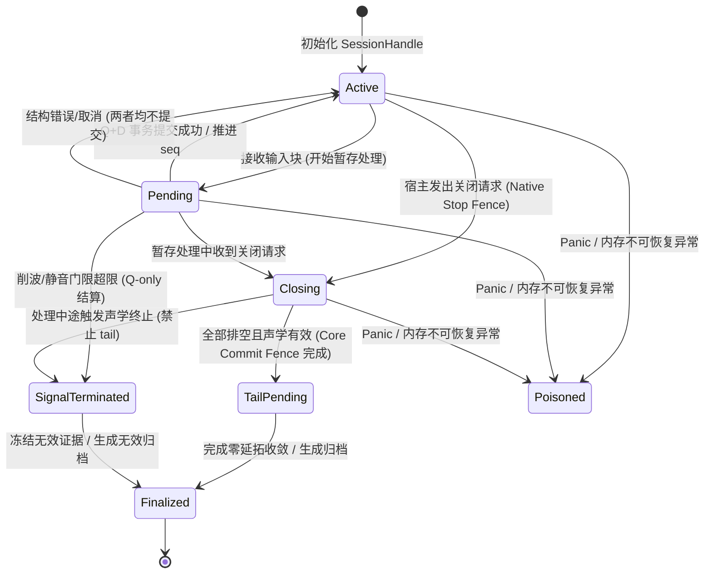
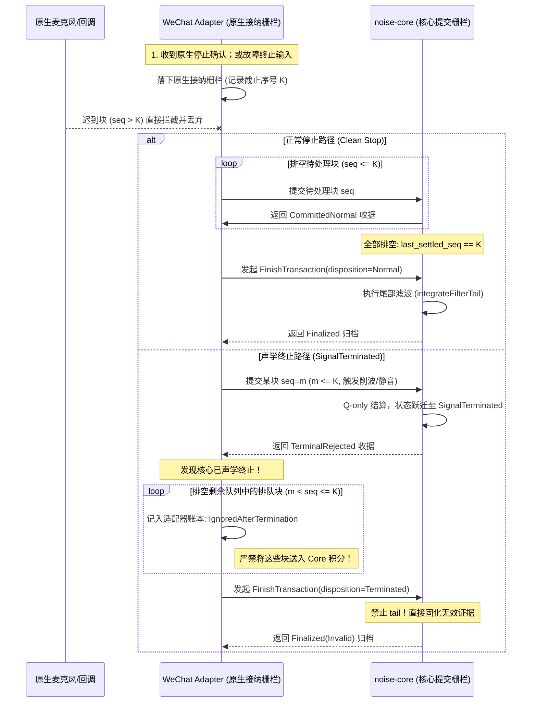

# Phase 0 核心状态机与交互契约 (CORE_STATE_CONTRACT)

**版本标识**：Phase 0 初始设计草案（可复核初稿）  
**基线 Git 提交**：`3a0d6765147c56d2a73e1cec78f6106ae2e681ab`  
**责任归属**：Task B 独占文件（由 Antigravity 代理实施，对齐 Codex 迁移实施方案）  
**编写原则**：以 `_work/baseline/` 导出源码为事实依据，严格区分“基线代码既有事实”与“未来 Rust 核心/适配器契约规划”。当前阶段不编写生产 Rust 代码、不修复基线既有缺陷、不修改小程序生产代码。

---

## 1. 契约范围与设计原则

本契约规范未来共享声学核心库（`noise-core`）、宿主适配层（`WeChat adapter`）及应用层之间的交互边界、状态演化时序、事务提交、背压与异常控制。

### 1.1 核心边界约束
1. **纯确定性计算核心（`noise-core`）**：
   - 不调用微信小程序 API（`wx.*`）、原生硬件录音接口（`RecorderManager`）、网络、存储或系统时钟（`Date.now()`）。
   - 仅依赖调用方输入的 Int16 PCM 音频块、显式会话控制指令、采样率配置及校准偏置参数。
   - 所有信号积分、能量累计、频谱分析、质量判定均具备幂等与确定性输出。
2. **区分基线既有事实与未来规划接口**：
   - **基线既有事实**：锁定基线 `_work/baseline/` 目录中的 JavaScript 单线程实现行为，保留其执行顺序、分支条件和状态更新点。
   - **未来规划接口**：Phase 1+ 中在 `noise-core` 和 `noise-wasm` 层面定义的 Rust 数据结构、状态机枚举与 FFI/WASM 交互协议。本契约严禁假称已有 Rust 协议存在。
3. **权威路径与影子比较语义**：
   - 迁移初期（Phase 4），微信小程序生产主线中的 legacy JS 保持唯一权威决策地位。
   - Rust 核心以影子模式（Shadow Mode）运行，仅作为比对输入，其执行异常或降级不得破坏小程序正常采集与保存。

---

## 2. 基线事实还原与源码证据核对

以下内容均直接对照基线只读代码 `_work/baseline/` 核实并标注具体行号。

### 2.1 帧摄入与格式核验
- **源码位置**：`_work/baseline/pages/main/main.js` [第 386–396 行](file:///C:/Users/Shaoyilei/WeChatProjects/noise-1/rs-core/_work/baseline/pages/main/main.js#L386-L396)
- **基线逻辑事实**：
  1. `handleRecordedFrame(page, res)` 首先校验 `isMainMonitoringActive` 与 `page` 活跃状态（L387–389）。
  2. 提取 `res.frameBuffer`，核验其存在性、`byteLength` 为有限数值且必须能被 2 整除（16-bit PCM 字节对齐，L391–394）。
  3. **奇数大小或非法格式**：直接调用 `markMainMeasurementInvalid('音频数据格式无效，请重新测量')` 并中断后续处理（L393–394）。
  4. **零长度或已失效**：`const buffer = new Int16Array(frameBuffer); if (!buffer.length || inputOverloaded || measurementInvalidReason) return;`（L395–396）。
     - *关键事实*：若为零长度空块，基线静默返回（不报错也不推进任何计数）；若此前已标记输入过载或测量失效，后续帧直接静默抛弃，不再进入质量检查或 DSP 积分。

### 2.2 质量检查与整块拒绝（Q+D 提交 vs Q-only 终止）
- **源码位置**：
  - `_work/baseline/utils/audio-quality.js` [第 2–32 行, 第 36–90 行](file:///C:/Users/Shaoyilei/WeChatProjects/noise-1/rs-core/_work/baseline/utils/audio-quality.js#L2-L32)
  - `_work/baseline/pages/main/main.js` [第 397–415 行](file:///C:/Users/Shaoyilei/WeChatProjects/noise-1/rs-core/_work/baseline/pages/main/main.js#L397-L415)
- **基线逻辑事实**：
  1. `inspectPcm(buffer, inputQualityInspector)` 对 Int16 PCM 原始块执行质量检查（`audio-quality.js` L2–32）。
  2. `PcmQualityInspector` 维护 10 ms 滑动窗口（44100 Hz 下为 441 样本，L39），削波门限为 `railLimit = Math.max(2, Math.ceil(441 * 0.001)) = 2` 个样本（L40）。当样本值 `>= 32767 || <= -32768` 在滑动窗口内累计达到 2 个时，标记 `evidence.clipped = true`（L65–72）。
  3. **削波过载拒绝（Clipping Rejection）**：
     - `if (quality.clipped) { inputOverloaded = true; markMainMeasurementInvalid('输入过载，请降低电平后重新测量'); return; }`（`main.js` L400–404）。
     - *关键事实*：质量检查滑动窗口和削波证据已经前移并记录，但后续 `dcBlocker.process(buffer)`、`aWeightingFilter.process(bufferZ)`、能量积分和环形缓冲写回**完全被跳过**。
  4. **连续数字静音拒绝（Digital Silence Rejection）**：
     - 若 `quality.digitalSilence`（`peakAbs <= 1 || (max - min <= 2)`），递增 `silentSampleCount` 与 `consecutiveSilentSampleCount`（`main.js` L405–408）。
     - *重要事实（持续 DC 块处理）*：对于持续常数直流信号（如恒定 DC step），由于其极差 `max - min = 0 <= 2`，基线 `inspectPcm` 将其判定为 `noAcSignal = true` 并归入 `digitalSilence = true`（`audio-quality.js` L19–20）。当连续静音样本数累计达到 50 ms（`Math.round(44100 * 0.05) = 2205` 样本）时，基线直接调用 `markMainMeasurementInvalid('录音连续输出数字静音，本次结果无效'); return;`（`main.js` L409–412）。因此，持续长直流输入在全流程中会在进入 `DCBlocker` 前被整块拒绝并声学终止；`DCBlocker` 的 2 Hz 高通衰减特性属于独立 DSP 单元测试，不可作为整段录音接受测试。
  5. **亚满幅与平台警告（Near-full & Plateau Warnings）**：
     - `abs >= 32112`（约 -0.17 dBFS）记录 `nearFullScale = true`；检测到平台波形记录 `plateauSuspected = true`（`audio-quality.js` L11, L76–79）。
     - 这两类仅作为质量警告（Warning）随帧记录，不触发中断，数据正常进入 DSP 处理（`main.js` L398–399, L426–482）。

### 2.3 DC 隔离、滤波与积分时序
- **源码位置**：
  - `_work/baseline/utils/audio-quality.js` [第 102–125 行](file:///C:/Users/Shaoyilei/WeChatProjects/noise-1/rs-core/_work/baseline/utils/audio-quality.js#L102-L125)
  - `_work/baseline/utils/audio-math.js` [第 66–164 行](file:///C:/Users/Shaoyilei/WeChatProjects/noise-1/rs-core/_work/baseline/utils/audio-math.js#L66-L164)
  - `_work/baseline/pages/main/main.js` [第 426–482 行](file:///C:/Users/Shaoyilei/WeChatProjects/noise-1/rs-core/_work/baseline/pages/main/main.js#L426-L482)
- **基线逻辑事实**：
  1. `bufferZ = dcBlocker.process(buffer)`：输入按 `x = pcm[i] / 32768.0` 归一化，通过 2 Hz 高通滤波器计算，**写出为 `Float32Array`**（`audio-quality.js` L109–123）。内部保存跨块状态 `previousInput` 与 `previousOutput`。
  2. **块级 RMS 计算**：`energyZ = calculateRMS(bufferZ); dbfsZ = calculateDb(energyZ, 1); dbsplZ = dbfsZ + offset;`（`main.js` L427–429）。该 RMS 是在去直流后的 `bufferZ` 整块上执行均方根，代表当前硬件回调块的瞬态电平，暂存至 `lastFrameLevels`。
  3. `bufferA = aWeightingFilter.process(bufferZ, false)`：接收 `Float32Array`（`normalize = false`），经过两个级联双二阶节（直接 II 型转置）加 129 抽头、128 阶 FIR 滤波器卷积，**写出为 `Float32Array`**（`audio-math.js` L111, L133–163）。
  4. **逐样本循环累计**（`main.js` L440–482）：
     - `totalAWeightedEnergySum += energyA; totalAWeightedSampleCount++;`
     - `intervalZWeightedEnergySum += normalizedZ * normalizedZ; intervalZWeightedSampleCount++;`
     - `pcmRingBuffer[pcmWriteIndex] = normalizedZ * 32768; pcmWriteIndex = (pcmWriteIndex + 1) % fftSize;`

### 2.4 秒级边界与块 RMS 口径
- **源码位置**：`_work/baseline/pages/main/main.js` [第 326–375 行, 第 478–481 行](file:///C:/Users/Shaoyilei/WeChatProjects/noise-1/rs-core/_work/baseline/pages/main/main.js#L326-L375)
- **基线逻辑事实**：
  1. `intervalSampleCounter` 在帧内逐样本递增。当达到 `sampleRate`（44100 样本）时触发 `finalizeMeasurementSecond(page, dbfsZ, dbsplZ)`，计数器减去 44100（L478–481）。
  2. 秒级区间计算：`intervalDbsplZ = calculateLeqFromEnergy(intervalZWeightedEnergySum, intervalZWeightedSampleCount, offset);`（L328–332）。随后区间累加器清零。
  3. 秒级点推入 `dBArray`：`recordArray(time, intervalDbsplZ)`（L337）。
  4. 刷新累计 CNE 与预警判定（L343–374）。
  5. *口径区分*：当前块 RMS（`energyZ`）仅反映单个硬件 PCM 帧；而秒级事件中的 `intervalDbsplZ` 是整整 44100 个有效样本的积分能量；累计 `leqA` 则是整个会话自首个样本起的全部 `totalAWeightedEnergySum` 的均方能量。三者绝不可混淆。

### 2.5 频谱环形缓冲与按需查询
- **源码位置**：
  - `_work/baseline/pages/main/main.js` [第 56–62 行, 第 307–324 行, 第 435–470 行, 第 829–850 行](file:///C:/Users/Shaoyilei/WeChatProjects/noise-1/rs-core/_work/baseline/pages/main/main.js#L56-L62)
  - `_work/baseline/utils/fft.js` [第 119–151 行](file:///C:/Users/Shaoyilei/WeChatProjects/noise-1/rs-core/_work/baseline/utils/fft.js#L119-L151)
  - `_work/baseline/utils/canvas-spectrum.js` [第 33–82 行](file:///C:/Users/Shaoyilei/WeChatProjects/noise-1/rs-core/_work/baseline/utils/canvas-spectrum.js#L33-L82)
- **基线逻辑事实**：
  1. 环形缓冲容量为固定 `FFT.SIZE = 32768` 样本，以去直流后的归一化浮点乘以 32768 存入 `pcmRingBuffer`（`Float64Array`，`main.js` L56, L450）。
  2. `spectrumNeeded = currentViewMode === 'spectrum' || currentViewMode === 'spectrogram'`（L435）。
  3. **跳步（Hop）计算仅在视图需要时触发**：
     - 当填满 32768 样本后，每推进 `fftHopSize = 8192` 个样本时，**仅在 `spectrumNeeded == true` 时**才调用 `updateSpectrumFromRingBuffer()`（L463–469）。
     - 若当前为波形视图（`waveform`），仅递增并回绕 `fftSampleCount`，**完全不计算 FFT**！
  4. **视图切换时的按需查询与 Legacy 副作用区分**：
     - 当用户点击切换至频谱或频谱图模式时（`switchView`，L831, L841）：
       `if (pcmBufferedSamples === CANVAS_CONFIG.FFT.SIZE) updateSpectrumFromRingBuffer();`
     - 基线 `updateSpectrumFromRingBuffer()` 直接从当前 `pcmRingBuffer` 中复制 32768 点执行 `computeSpectrum` 与 `computeThirdOctaveBands`。该操作不消耗音频样本、不移动读写指针、不推移 hop 计数器、不影响秒级积分。
     - *重要实现差异*：基线 legacy helper 具有显示副作用，它会写回全局变量 `spectrumBandLevels`（L320），且当 `spectrogramState` 存在时会调用 `appendSpectrogramColumn`（L322）向频谱图 ImageData 插入列；而未来 `noise-core` 规范要求将其设计为只读 DSP 状态的真正纯查询，不修改任何宿主显示缓存。

### 2.6 停止生命周期与尾部滤波处理
- **源码位置**：
  - `_work/baseline/pages/main/main.js` [第 531–549 行, 第 1181–1231 行](file:///C:/Users/Shaoyilei/WeChatProjects/noise-1/rs-core/_work/baseline/pages/main/main.js#L531-L549)
  - `_work/baseline/utils/audio-math.js` [第 168–185 行](file:///C:/Users/Shaoyilei/WeChatProjects/noise-1/rs-core/_work/baseline/utils/audio-math.js#L168-L185)
- **基线逻辑事实**：
  1. 用户点击停止后进入 `stopNoiseMonitoring()`（`main.js` L1181–1194）：设置 `_mainStopRequested = true`，状态变为 `stopping`，启动 2250 ms 兜底超时，并调用 `safeStopRecorder(recorderManager)`。
  2. **停止超时无原生确认的基线行为**：若 2250 ms 内未收到原生 `Stop` 事件（L1187–1192），超时回调执行 `measurementInvalidReason = '录音停止未确认，本次结果无效'; this.completeRequestedMainStop();`。由于缺少原生时长且已置失效原因，`filterTail` 被跳过，归档快照为 `valid=false`, `canSave=false`, `dataQuality='invalid'`。基线绝不发明所谓的“兜底冻结为完整结果”。
  3. 原生录音机正常触发 `Stop` 事件（L531–549）：分发到 `completeRequestedMainStop(res)`（L1196–1231）。
  4. **尾部零延拓积分触发条件**（`main.js` L1210–1214）：
     ```javascript
     if (!filterTail && totalAWeightedSampleCount > 0 && !measurementInvalidReason) {
       filterTail = require('../../utils/audio-math').integrateFilterTail(
         aWeightingFilter, totalAWeightedEnergySum, CANVAS_CONFIG.FFT.SAMPLE_RATE);
       totalAWeightedEnergySum += filterTail.energy;
     }
     ```
     - **关键事实 1（禁止 tail）**：若 `measurementInvalidReason` 非空（即会话已因削波、断流、超时未确认、格式错误等变为 `invalid`），**严禁执行尾部滤波**！
     - **关键事实 2（分母不增）**：`filterTail.energy` 累加进入能量分子 `totalAWeightedEnergySum`，但真实采样点数 `totalAWeightedSampleCount` **保持不变**（分母不增加任何补零样本数）。
     - **关键事实 3（幂等保护）**：`!filterTail` 保证多次触发不会重复累加尾部能量。

---

## 3. 会话生命周期与核心状态机

未来 Rust 核心（`noise-core`）在会话生命周期内严格实现有限状态机。这些状态描述核心内部的计算与输入接纳状态，与宿主小程序的 UI 页面状态保持单向映射。



### 3.1 状态定义与语义
1. **`Active`（活跃就绪）**：
   - 会话正常接纳音频块，内部累加器及滤波器处于已提交稳态。
2. **`Pending`（暂存结算中）**：
   - 正在处理当前块的计算步骤。此时外部发起的任何快照查询**只能读取上次已提交（Committed）的状态**，暂存数据严格隔离不可见。
3. **`Closing`（正在关闭）**：
   - 宿主已发出停止指令或原生录音已停止。原生输入接纳栅栏已关闭，核心正在排空当前待提交事务。
4. **`SignalTerminated`（信号声学终止）**：
   - 输入命中削波超限或连续数字静音超限等硬性无效条件。
   - **严格约束**：核心立即冻结质量证据并拒绝后续 DSP 输入；**绝对禁止进入 `TailPending`，绝不累计尾部能量**。
5. **`TailPending`（尾滤波结算中）**：
   - 仅限正常无声学故障的会话在所有已接纳有效块结算完毕后进入。执行有限零延拓尾冲刷。
6. **`Finalized`（已归档完成）**：
   - 会话最终度量或失效摘要已完全固化，对外提供只读查询。重复调用 `finalize` 不得改变任何度量值。
7. **`Poisoned`（崩溃失效）**：
   - 核心遭遇 WASM 陷阱（Trap）或内部不可恢复断言。状态彻底废弃，拒绝一切后续计算与取值。

### 3.2 严格时序规则：`native stop != finalized`
在微信小程序及真实移动端架构中，**原生录音停止（Native Stop）与核心计算完成（Finalized）存在显著的时序差距**：
1. 用户在 UI 触发停止时，平台底层仅发起异步停止通知。
2. 操作系统与微信框架的底层音频管道中，仍有若干正在传输或已在回调队列中的 PCM 尾帧。
3. 即使原生录音管理器已触发 `Stop` 回调，适配器仍必须先执行输入接纳栅栏核验，判定是否为声学终止。
4. 未来异步核心只有完成下述双重栅栏与尾积分（或终止结算）后才能进入 `Finalized`。基线是同步 JS 处理，在 `onStop` 中同步完成结算；不能把异步核心的新要求误称为基线已有的异步协议。

---

## 4. 输入结算与事务契约

每个送入核心的输入块必须且仅能通过以下确定的事务语义进行结算。严禁存在“计算了一半、部分状态泄漏可见”的脏状态。

| 输入情形 | 判定标准 | 质量状态（Q） | DSP 状态（D） | 软件序号推进 | 最终收据类型（Receipt） |
| :--- | :--- | :--- | :--- | :--- | :--- |
| **结构/句柄/参数非法** | 句柄无效、长度为奇数、参数越界 | 不提交 | 不提交 | 不推进 | `RejectedError(InvalidFormat)` |
| **背压阻塞** | 核心事件/收据队列已满 | 不提交 | 不提交 | 不推进 | `WouldBlock` |
| **正常有效块** | 无削波、无连续静音超限 | 提交 | 提交 | 递增（+1） | `CommittedNormal` |
| **亚满幅/平台警告块** | 满足 Near-full 或 Plateau | 提交（附带警告） | 提交 | 递增（+1） | `CommittedWithWarning` |
| **削波超限拒绝** | 滑动窗口内削波样本 $\ge 2$ | **提交质量证据** | **拒绝并不予提交** | 递增（+1） | `TerminalRejected(Clipped)` |
| **连续静音超限拒绝** | 连续静音累计 $\ge 2205$ 样本 | **提交质量证据** | **拒绝并不予提交** | 递增（+1） | `TerminalRejected(DigitalSilence)` |
| **声学终止后的排队块** | 会话已处于 `SignalTerminated` | 忽略（由适配器结算） | 不提交 | 不推进 | `IgnoredAfterTermination` |
| **WASM Panic / Trap** | 内存越界或底层不可恢复异常 | 状态废弃 | 状态废弃 | 废弃 | `Poisoned` |

### 4.1 正常 Q+D 原子提交
对于通过质量检验的音频块，质量证据更新（min/max/peak/滑动窗口）与 DSP 计算（DC 滤波、A 计权滤波、逐样本积分、环形缓冲写入）构成强原子事务。核心必须保证两者要么同时生效、推进 `chunk_seq`，要么在执行失败时完整回滚至该块处理前的状态。

接口参数错误与实际采集数据格式损坏须区分：核心接口错误可保持已提交状态不变，但 adapter 遇到基线意义的奇数字节/缺失缓冲时，须按 main.js L393 标记整段采集失效并关闭输入，最终以无效 disposition 结束且跳过 tail。不能因核心未提交 Q/D 而把该录音恢复成正常结果。

### 4.2 拒绝 Q-only 结算契约
当块内样本触发硬性拒绝条件时（例如 `quality.clipped == true`）：
1. **质量状态提交**：核心记录该块呈现的削波时间区间、峰值、轨值统计；
2. **DSP 状态不推进**：该块的音频数据**绝对不得**送入 `DCBlocker`、`AWeightingFilter`，不计入 `totalAWeightedEnergySum`，亦不计入 `totalAWeightedSampleCount`；
3. **软件序号推进**：由于该块已被摄入并完成声学判定，其消耗一个软件序号 `chunk_seq`，并生成 `TerminalRejected` 收据；
4. **会话转入终止**：会话状态立即切换为 `SignalTerminated`，锁定 `measurementInvalidReason`。

### 4.3 样本计数体系的三权分立
核心必须在内部严格区分并输出三套样本计数器，禁止混淆：
1. `consumed_input_samples`：所有被摄入并完成判定的有效原始 PCM 样本总数（包含正常块与触发终止块的样本数）。
2. `integrated_samples`（即基线中的 `totalAWeightedSampleCount`）：真正参与去直流、A 滤波及能量加权积分的样本数。
3. `tail_zero_samples`（即基线中的 `filterTail.paddingSamples`）：录音结束时，仅用于释放滤波器内部延迟线残余能量而虚拟喂入的零样本总数。该计数严禁计入 `integrated_samples`。

---

## 5. 双重关闭栅栏与排队忽略块

为解决移动端多线程及异步回调导致的“停止期间迟到块”、“声学终止后已在队列中的残留块”问题，本契约建立两级栅栏机制：



### 5.1 栅栏 1：Adapter 原生接纳栅栏（Native Admission Fence）
- 正常触发时机：收到微信原生 `Stop` 确认。用户请求停止到原生确认之间，仍按基线接纳有效尾帧。声学终止或停止超时则按故障路径关闭接纳，不伪装为正常完整停止。
- 职责：
  1. 立即锁定适配器当前摄入通道，记录当前已接纳的最大原生帧序号 $K$。
  2. 阻止后续任何新增硬件回调帧进入输入队列。
  3. 建立输入账本：保证序号 $1 \le seq \le K$ 的每一个块均有明确的结算归宿。

### 5.2 栅栏 2：Core 提交结算栅栏（Core Commit Fence）
- 职责与分流规则：
  - **正常停止分支**：适配器依序向核心提交直至最后一块 $K$。核心确认 `last_settled_seq == K` 且无正在执行中的 `Pending` 事务后，方可处理尾部滤波。
  - **声学终止分支**：若某一块 $m$（$m \le K$）在核心内部触发声学终止（`SignalTerminated`），适配器队列中已排队但尚未提交核心的块（$m < seq \le K$）**严禁继续送入核心执行计算**！适配器在自身账本中将它们结算标记为 `IgnoredAfterTermination`。核心提交栅栏直接以 $m$ 结案，不要求核心必须对后续忽略块积分才能满足结算平衡。

---

## 6. 序号、收据（Receipt）、事件流与背压契约

### 6.1 会话代次与单调序号
- 每个测量会话在创建时分配唯一的 64-bit `session_generation`。
- 每个送入该会话的音频块携带严格自增的 32-bit `chunk_seq`（从 1 开始）。重复已提交序号不得再次积分；提交结果不确定时先查询已提交收据/状态，不盲重放 PCM。收据保留范围、ack 与过期查询的具体 ABI 在编码前冻结。
- **软件序号语义**：`chunk_seq` 仅代表适配器向核心提交处理的软件时序凭证，**不证明底层硬件麦克风没有丢帧**。底层丢帧证据由原生返回的 `duration` 结合总采样数比对判定（对应基线 `captureIntegrity.sampleDelta`，见 `main.js` L1206）。

### 6.2 结构化收据（Chunk Receipt）
核心每次完成输入块处理后，必须返回确定性的结构化收据，其格式定义规划如下：
```rust
// 规划中的 Rust 核心收据类型（Phase 1 实施）
pub struct ChunkReceipt {
    pub session_generation: u64,
    pub chunk_seq: u32,
    pub disposition: ChunkDisposition,
    pub integrated_samples: u64,
    pub consumed_samples: u64,
    pub block_rms_dbfs: f64, // 基线 Math.sqrt/log10 结果为 JS number，不额外写回 f32
    pub cumulative_energy: f64,
    pub quality_flags: QualityFlags,
}

pub enum ChunkDisposition {
    Committed,
    TerminalRejected(RejectReason),
    IgnoredAfterTermination,
}
```

### 6.3 严格背压契约（Backpressure Contract）
核心内部为收据队列与事件流维护有界环形缓冲（Bounded Buffer）。
1. **背压产生**：当宿主适配器未及时读取（Drain/Ack）核心事件，导致内部缓冲区达到高水位警戒线时，核心拒绝继续接纳新块的提交，立即返回 `WouldBlock` 状态。
2. **禁止静默丢弃**：核心严禁在未通知宿主的情况下静默丢弃音频样本。
3. **双模式处置策略**：
   - **影子模式（Shadow Mode）**：若 Rust 核心产生背压阻塞，适配器标记当前比对结果为 `IncompleteComparison`，Legacy JS 权威主线不受影响继续录音。
   - **Rust 主导模式（Rust-Primary Mode）**：若 Rust 核心发生背压阻塞且超过预设缓冲时限，适配器必须主动中止测量并标记系统故障，严禁静默丢弃 PCM 后假称完成了完整性度量。

---

## 7. 频谱查询纯度契约 (Spectrum Query Purity Contract)

### 7.1 核心只读纯度保证与 Legacy 副作用剥离
基线事实明确证实，频谱分析仅供前端渲染展示，不参与声学声级与暴露积分计算。
然而，基线 legacy 实现函数 `updateSpectrumFromRingBuffer()` 混入了前端状态修改：它会就地修改全局变量 `spectrumBandLevels`（`main.js` L320），且当 `spectrogramState` 存在时会调用 `appendSpectrogramColumn` 向 Canvas ImageData 缓存写入像素（L322）。
未来 `noise-core` 的 `query_current_spectrum` 接口规划必须严格剥离此类前端缓存修改，遵从纯计算规范：
1. **纯只读已提交缓冲**：直接从当前核心已提交的环形缓冲（32768 点）中读取数据，执行 Hann 窗、FFT 与 1/3 倍频程计算，严禁修改任何宿主画布或显示状态。
2. **不推移任何内部时钟**：调用本接口**绝对不得**修改音频样本索引、不得推进 `fftSampleCount`、不得改变秒级区间计数器、不得产生业务事件。
3. **完整窗就绪前置条件**：若核心已提交的真实有效样本数尚未填满 32768 点（对应基线 `pcmBufferedSamples < FFT.SIZE`），接口必须返回明确的 `NotAvailable` 或 `InsufficientData`，严禁借用未初始化的脏内存参与计算。
4. **内存安全性**：在 WASM/FFI 边界上，查询返回的频谱数组应采用显式借用（Borrow）或写入宿主预分配缓冲区的方式传递，避免跨语言边界产生悬垂指针。

---

## 8. 未来 Rust 接口规范规划（Phase 1+ 蓝图）

> **重要声明**：本节所列 Rust 结构体与 Trait 仅作为 Phase 0 文档制定的**未来接口规范蓝图**，旨在明确跨阶段演化契约。当前 Phase 0 阶段不存在这些 Rust 源码，亦严禁宣称已有 Rust 代码实现。

```rust
// 规划中的 noise-core 核心接口规范
pub trait AudioCoreEngine {
    /// 创建新测量会话
    fn create_session(config: SessionConfig) -> Result<SessionHandle, CoreError>;

    /// 提交音频输入块 (Q+D 原子结算或 Q-only 终止)
    fn process_chunk(
        handle: SessionHandle,
        seq: u32,
        pcm: &[i16],
    ) -> Result<ChunkReceipt, CoreError>;

    /// 按需查询当前频谱 (纯查询，无副作用)
    fn query_spectrum(
        handle: SessionHandle,
        offset_db: f64,
        out_bands: &mut [f64; 29],
    ) -> Result<(), CoreError>;

    /// 发起结束会话并获取最终归档快照
    fn finalize_session(
        handle: SessionHandle,
        disposition: FinalizeDisposition,
    ) -> Result<SessionArchiveSnapshot, CoreError>;

    /// 释放会话资源
    fn destroy_session(handle: SessionHandle) -> Result<(), CoreError>;
}
```

---

## 9. 待决事项与待审清单 (Open Questions & Pending Review)

以下技术细节在基线中存在运行时隐含行为，已在当前契约中显式隔离，列为待审项供协调者与后续阶段复核：
1. **[待审核-01] 零长度空块的序号分配**：基线 `main.js` L396 对 `!buffer.length` 执行静默 `return`，未推进任何状态。未来 Rust 核心应规定空块是直接由 Adapter 过滤拦截、还是分配 `seq` 并返回 `ZeroLengthIgnored` 收据？
2. **[待审核-02] 移动端 Worker 跨线程背压水线**：若后续 WASM 运行于微信 Worker 线程，PostMessage 通信存在微秒至毫秒级延迟，收据队列大小（建议 16~32 块）需在 Phase 0A 真机验证中实测其内存与延迟表现。
3. **已锁定的特殊返回**：基线 `canvas-spectrum.js` L67 在 `startBin > endBin` 时返回 `-Infinity`，存在 bin 时施加 `1e-20` 下限。迁移保留这两个分支；序列化非有限值的表示方式需在 ABI 冻结时明确，不能改数学结果。
